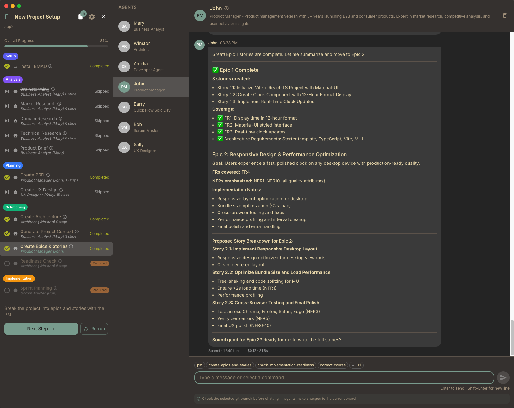

<div align="center">
  
  <p><strong>Visualize your sprint progress with a clean, intuitive interface</strong></p>

    
</div>

---



## Features

- **Sprint Board**: Visualize stories across columns (Backlog, Ready for Dev, In Progress, Review, Done)
- **Epic Organization**: Stories grouped by epic with color-coded badges
- **Story Details**: View acceptance criteria, tasks, subtasks, and file changes
- **Search & Filter**: Find stories by text or filter by epic
- **Dark/Light Mode**: Toggle between themes
- **Auto-Refresh**: File watching detects changes to story files
- **Collapsible Columns**: Minimize columns to focus on active work
- **Command Palette**: Quick access to actions with keyboard shortcuts
- **AI Agent Integration**: See which AI teammates are working on stories with real-time indicators
- **Agent Chat Sidebar**: Sliding chat panel to communicate with AI agents (`Cmd+Shift+A`)
- **Git Integration**: View uncommitted changes, switch branches, and see git diffs for stories
- **Project Switcher**: Quickly switch between multiple BMAD projects
- **Keyboard Shortcuts**: Comprehensive shortcuts for efficient navigation

## Compatibility

| Requirement | Supported |
|-------------|-----------|
| BMAD Version | **BMAD 6** |
| Project Types | BMAD, BMAD Game |

## Download

[](https://github.com/hacking-robot/bmad-board/releases/latest)

| Platform | Download |
|----------|----------|
| macOS | [](https://github.com/hacking-robot/bmad-board/releases/latest) |
| Windows (Not tested)| [](https://github.com/hacking-robot/bmad-board/releases/latest) |
| Linux (Not tested) | [](https://github.com/hacking-robot/bmad-board/releases/latest) |

## Build from Source

```bash
# Clone the repository
git clone https://github.com/yourusername/bmadboard.git
cd bmadboard

# Install dependencies
npm install

# Run in development mode
npm run electron:dev

# Build for production
npm run build
```

## Usage

1. Launch BMad Board
2. Select your BMAD or BMAD game project folder
3. View your stories organized by status
4. Click a story card to view full details
5. Use `Cmd+P` to open the command palette for quick actions


## Tech Stack

- React 18 + TypeScript
- Electron 33
- MUI (Material UI) 6
- Zustand for state management
- Vite + electron-builder

## License

MIT
